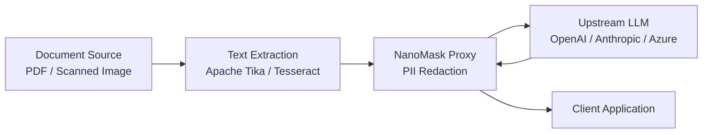

# NanoMask Document Workflow Strategy

NanoMask processes **text and JSON payloads**. Binary document formats (PDF, TIFF, DOCX, images) must be pre-processed by an upstream extraction service before NanoMask can redact PII.

## Boundary Definition

### What NanoMask Handles

- **JSON request/response bodies** — schema-aware redaction, HASH pseudonymization
- **Plain text payloads** — SSN, entity, pattern, and fuzzy matching
- **SSE / NDJSON streams** — per-event forwarding with entity unmasking
- **Response restoration** — entity unmasking, HASH unhashing

### What NanoMask Does NOT Handle

- PDF text extraction or OCR
- Image-to-text conversion
- DOCX/XLSX parsing
- Audio transcription

## Recommended Architecture

For document-centric workflows, deploy a text extraction sidecar **before** NanoMask:

| Component | Role | Example |
|---|---|---|
| **Text Extractor** | Convert binary → text/JSON | Apache Tika, Tesseract, AWS Textract |
| **NanoMask** | Redact PII from extracted text | `nanomask:latest` |
| **Upstream LLM** | Process redacted text | Any OpenAI-compatible API |

## Content-Type Handling

NanoMask's body policy classifies request payloads by Content-Type:

| Content-Type | Policy | Notes |
|---|---|---|
| `application/json` | **Redact** | Full pipeline (SSN, entity, schema, patterns) |
| `text/plain` | **Redact** | Full pipeline |
| `text/event-stream` | **Stream** | Per-event forwarding |
| `application/x-ndjson` | **Redact** | Line-delimited JSON |
| `application/pdf` | **Bypass** | Returned untouched — extract text first |
| `image/*` | **Bypass** | Returned untouched — use OCR first |
| `application/xml` | **Reject** (default) | Configurable via `--unsupported-request-body` |

## Validation Guidance

To verify your document pipeline:

1. **Extract text** from your document using your chosen extractor
2. **Send the extracted text** to NanoMask as a `application/json` or `text/plain` payload
3. **Check the upstream request** received by the LLM for PII leakage
4. **Verify the response** is correctly restored (entity unmasking, HASH unhashing)

## Reference Implementation

See [`examples/document_pipeline/`](../examples/document_pipeline/) for a Docker Compose reference workflow.
